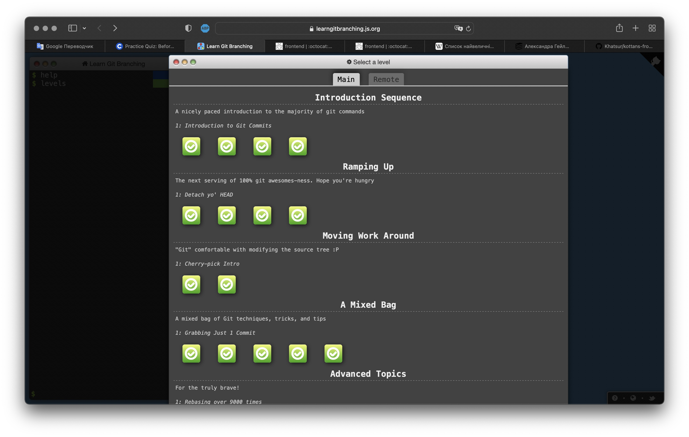
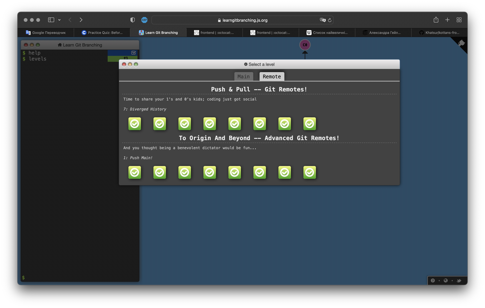

# Ich heiße Nicolas. 

## Git та GitHub

Дякую організаторам за гарний і ефективний курс по Git Basics. Для мене це не зовсім проста тема. Інформація, що викладена на ресурсі learngitbranching.js.org, добре сприймається. Гарно, просто і зрозуміло. 

## Linux CLI, and HTTP

1.	Просте і зрозуміле пояснення матеріалу. Новий матеріал був починаючи з другого розділу. Я раніше не працював з Linux, але використовував деякі команди в терміналі. В цілому нового було багато.  Якщо буду працювати у галузі веб-розробки, то напевне буду використовувати. 
2.	Стаття потрібна. Розумію. Нового матеріалу також багато. Важко зрозуміти все за один раз.
3.	Як у п.2.
